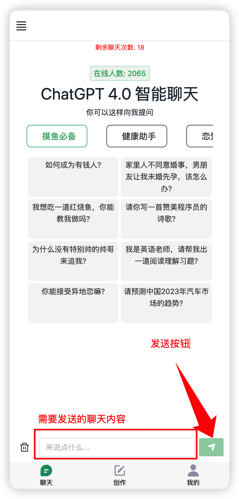
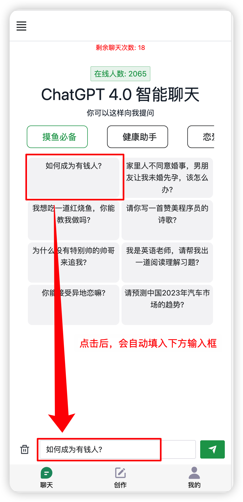
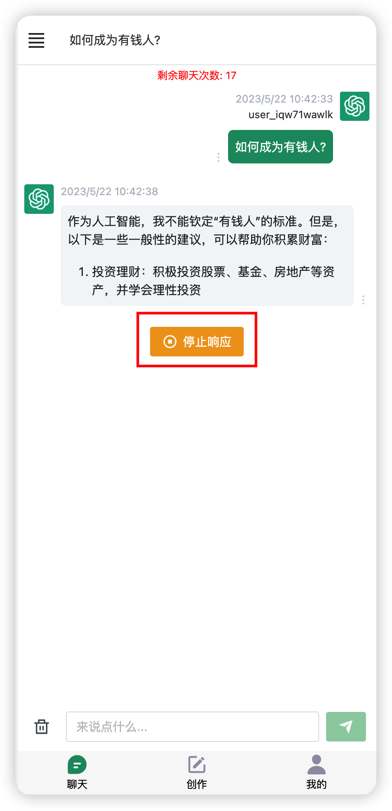

# 聊天

在底部输入你要聊天的内容，然后点击右侧按钮发送即可和ChatGPT4.0进行聊天。

<figure><figcaption></figcaption></figure>

如果不清楚要怎么样提问，可以点击界面上给的提示，如点击“如何成为有钱人？”

<figure><figcaption></figcaption></figure>

在数据响应的过程中，可点击【停止响应】来停止接收数据

<figure><figcaption></figcaption></figure>
